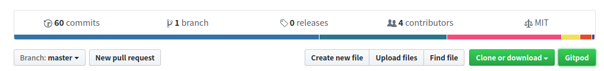
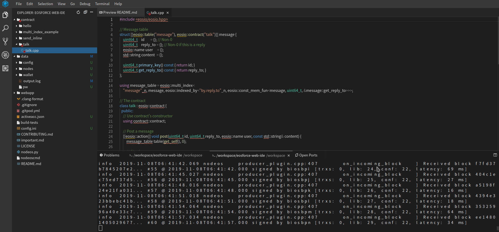
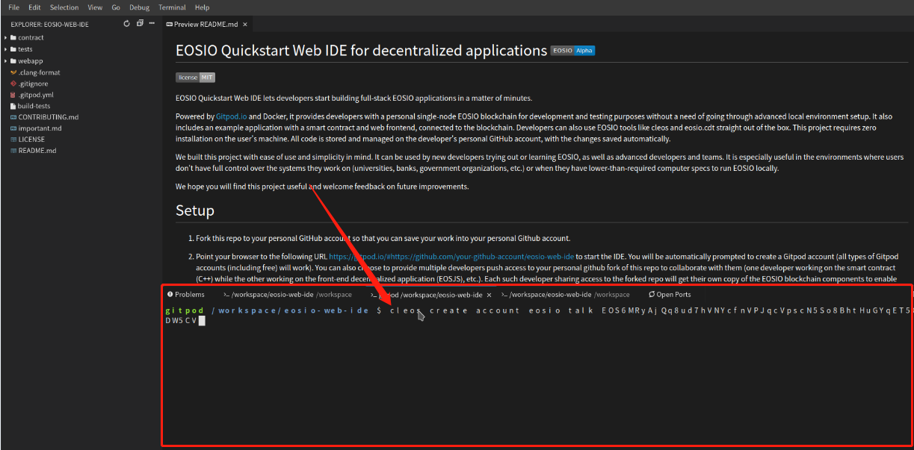

# 开发教程：EOS生态开发新工具Web IDE，一键进入开发调试

## Web IDE是什么？

各位小伙伴对IDE肯定不陌生，主要是用于提供程序开发环境的应用程序，一般包括代码编辑器、编译器、调试器和图形用户界面等工具。

web IDE则是将IDE里面除用户交互之外的功能全部移到了后台，开发人员在浏览器上可以像在本机一样调试、编译、运行程序，并且不会受系统环境和机器性能的限制。


（图为一款web IDE的系统架构）

目前的web IDE主要有AWS Cloud9、Cloud Studio、Eclipse Che、Gitpod等，这些web IDE各有千秋，其中Gitpod是目前web IDE中对Github上的项目支持最好的，也是eosio主推的一款产品。并且Gitpod对于非商用的开发者，每月会有100小时的免费使用时间，本文的讲解，也会以Gitpod为例（下文中提到的web IDE，在没有特指的情况下，全部为Gitpod）

关于Gitpod，可以参考[Gitpod说明文档](https://www.gitpod.io/docs/)

## 为什么要使用Web IDE

### 1. 环境搭建及运行节点门槛
对于很多区块链爱好者来说，想要搭建一个简单的环境来了解一个区块链项目，很大程度上会因为搭建环境以及初次运行过程中的各种问题而退缩。

对于智能合约开发者来说，很多时候会因为初次运行，或者环境切换等原因，在这个过程中耗费很多不必要的时间成本。

而Web IDE的出现，会让这些问题不再成为麻烦。拿eosio来说，想要启动一个节点，并且在节点上部署开发好的智能合约，并不是一件很简单的事，需要下载代码、安装依赖、编译代码、启动节点、编译合约、然后部署。在这个过程中，可能会出现非常多的问题，

EOSIO 2官方更新后，使用web IDE，只需要一键，就可以开始开发调试智能合约，消除开发人员的入门障碍。它在云中运行，使新开发人员能够建立智能合约和Web应用程序开发环境以及完全集成的单节点个人测试网，因此他们可以在几分钟之内从入门到构建。

### 2. 启动节点的机器性能要求

在计算机上运行一个eosio的节点，是非常耗费性能的，很多PC机可能根本没法成功运行一个eosio的节点，更不用说同时还打开IDE调试智能合约，而Web IDE将这些对机器性能的要求移到了后台，前端仅仅是一个交互页面。

### 3. 随处可用

传统IDE还有一个问题就是每次开发必须带上开发机或者每次改完代码都push到远程，而Web IDE解决了这个问题，它可以随时在远程保留开发环境，随时随地，只要有浏览器，就可以开始写合约。

## 以EOSC为例讲解使用步骤

EOSForce社区小伙伴在EOS WEB IDE上线的同时，构建了EOSC版本。得到了社区的大力支持，接下来将详细讲解使用教程。

### 1. 浏览器插件下载

Gitpod对Chrome和Firefox都提供了插件支持，下载插件后，会使进入Gitpod开始开发更加方便，本文以Chrome为例介绍使用步骤。

[Chrome插件下载](https://chrome.google.com/webstore/detail/gitpod-online-ide/dodmmooeoklaejobgleioelladacbeki)

### 2. 一键生成环境

插件下载成功后，打开eosio专门为使用web IDE开发智能合约准备的github项目[eosio-web-ide](https://github.com/EOSIO/eosio-web-ide)，我们会发现项目的主页上多了一个Gitpod按钮



点击Gitpod按钮，就可以直接进到一个节点已经启动好的环境中，并且这个环境提供了一些编写智能合约的模板（实际的开发环境中，建议大家先fork这个项目，然后再启动Gitpod）。

如果没有安装GitPod插件，可以直接在浏览器上新开一个页面，输入网址 https://gitpod.io/#https://github.com/xxxxx/eosforce-web-ide (其它xxxx替换成你的github用户名)



从图中可以看见，eos节点已经启动并且正在出块，同时整个编写智能合约的IDE环境已经搭建好，现在就可以使用web IDE直接开始开发智能合约了。

### 3. 开发调试合约

智能合约的具体开发、调试以及部署说明可以参考[eosio白皮书](https://github.com/EOSIO/Documentation/blob/master/TechnicalWhitePaper.md)，本文仅分析该项目模板合约的部署和调用

* 在web IDE中打开`contract/talk.cpp`文件，核心逻辑如下：
```
[[eosio::action]] void post(uint64_t id, uint64_t reply_to, eosio::name user, const std::string& content) {
        message_table table{get_self(), 0};

        require_auth(user);   // 检查用户

        if (reply_to)                   // 检查是否需要回复
            table.get(reply_to);

        // 检查id不能过大，并且当没有传的时候分配一个id
        eosio::check(id < 1'000'000'000ull, "user-specified id is too big");
        if (!id)
            id = std::max(table.available_primary_key(), 1'000'000'000ull);

        // 记录post的内容到table
        table.emplace(get_self(), [&](auto& message) {
            message.id       = id;
            message.reply_to = reply_to;
            message.user     = user;
            message.content  = content;
        });
    }
```

* 理清post方法的逻辑之后，就可以开始编译文件了，首先点击Gitpod上方导航栏的Terminal -> New Terminal(如下图)


可以看见Gitpod下方出现了一个新的命令行窗口



* 在该窗口执行如下命令，编译talk.cpp文件，会生成`talk.abi`和`talk.wasm`两个文件
```
eosio-cpp contract/talk.cpp
```
* 然后执行以下命令，创建合约账户并部署合约
```
cleos create account eosio talk EOS6MRyAjQq8ud7hVNYcfnVPJqcVpscN5So8BhtHuGYqET5GDW5CV
cleos set code talk talk.wasm
cleos set abi talk talk.abi
```
* 随后创建两个普通账户用来执行合约
```
cleos create account eosio bob EOS6MRyAjQq8ud7hVNYcfnVPJqcVpscN5So8BhtHuGYqET5GDW5CV
cleos create account eosio jane EOS6MRyAjQq8ud7hVNYcfnVPJqcVpscN5So8BhtHuGYqET5GDW5CV
```
* 执行合约，以下三个命令分别是
   * bob以1000为id，发布一条"This is a new post"消息到table，并且不需要回复
   * jane以2000为id，发布一条"This is my first post"消息到table，并且不需要回复
   * bob以1001为id，发布一条"Replying to your post"消息到table，并且回复jane
```
cleos push action talk post '[1000, 0, bob, "This is a new post"]' -p bob
cleos push action talk post '[2000, 0, jane, "This is my first post"]' -p jane
cleos push action talk post '[1001, 2000, bob, "Replying to your post"]' -p bob
```
* 最后，输入如下命令，查看table的内容
```
cleos get table talk '' message
```
得到如下结果，说明合约已经成功执行
```
{
  "rows": [{
      "id": 1000,
      "reply_to": 0,
      "user": "bob",
      "content": "This is a new post"
    },{
      "id": 1001,
      "reply_to": 2000,
      "user": "bob",
      "content": "Replying to your post"
    },{
      "id": 2000,
      "reply_to": 0,
      "user": "jane",
      "content": "This is my first post"
    }
  ],
  "more": false
}
```

### 4. 过程分析

下面具体分析一下这个一键生成环境的过程中都发生了什么

* 在任何一个github项目的地址前，加上https://gitpod.io/# ， 就可以在gitpod中打开该项目，例如在eosio-web-ide这个项目中点击Gitpod按钮，实际访问的就是https://gitpod.io/#https://github.com/EOSIO/eosio-web-ide 这个地址
* 打开Gitpod之后，Gitpod会根据项目中的 `.gitpod.yml` 文件来决定环境的初始化工作，该文件内容如下：
     
```
image: eosio/eosio-web-ide:v0.1.0    # Gitpod会加载eosio/eosio-web-ide:v0.1.0的docker镜像，该镜像里面会部署编译好的eos相关程序，以及其他一些需要使用到的文件

ports:                               # 配置环境中需要打开的端口
- port: 3000
  onOpen: ignore
- port: 8000
  onOpen: ignore
- port: 8080
  onOpen: ignore
- port: 8888
  onOpen: ignore
- port: 9876
  onOpen: ignore

tasks:                        # 初始化阶段的任务
- before: cd webapp
  init: yarn               # yarn会根据package.json文件去下载相关依赖包
  command: nginx -c $PWD/nginx.conf; npx webpack-dev-server      # 启动nginx反向代理
- before: cleos wallet unlock --password </password                              # 启动并解锁钱包
  command: nodeos --config-dir ~/eosio/chain/config --data-dir ~/eosio/chain/data -e -p eosio --plugin eosio::chain_api_plugin --contracts-console      # 启动nodeos
  ```

* 以上步骤结束后，一个完整的eos单节点环境就运行起来了，然后IDE会加载当前项目，开发人员就可以通过浏览器开发调试智能合约了

## 总结

通过以上步骤，很大的简化了编写和调试智能合约的难度，使得更多的开发者可以接触到这个优秀的区块链项目和智能合约。同时，有了这些web IDE的相关指导文档，越来越多的开源团队也可以发布自己基于web IDE项目，来方便开发者更好的对开源社区作出贡献。
